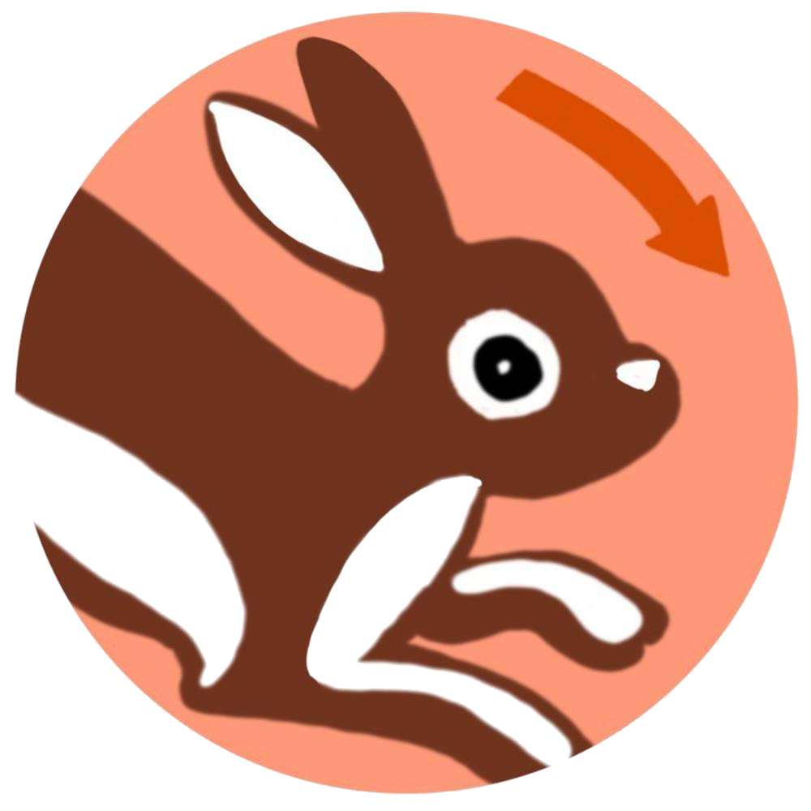

## Hop Hop Tab

This is an extension that jumps between currently open tabs, because sometimes the number of tabs open is just too high.

The shortcut is `Command+Shift+P` for MacOS, and `Ctrl+Shift+P` for every other place.

## Build Instructions:

1. Clone the repository.
2. Install dependencies: `yarn`.
3. Build the static build: `yarn build`.
4. Go to <chrome://extensions>, enable developer mode, and use `Load unpacked` to load the `dist` folder.
5. Press the `reload` button (the one that looks like the browser `reload` button) that's next to the extension. It will reload the extension from the code.

## Preview Instructions

1. Run the development server: `yarn run dev`.
2. Visit `http://localhost:3000`
